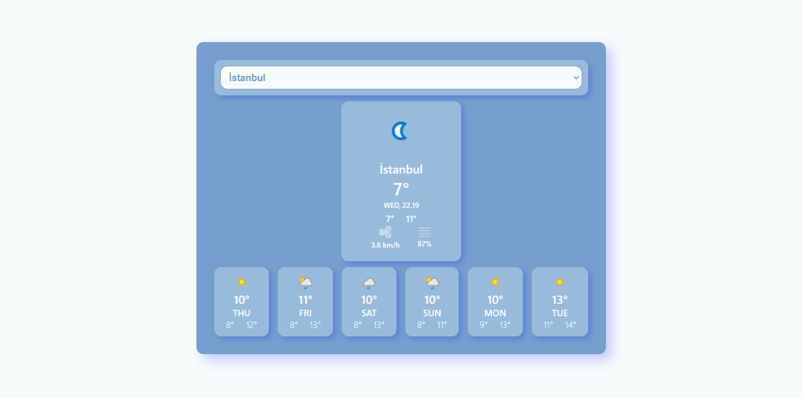
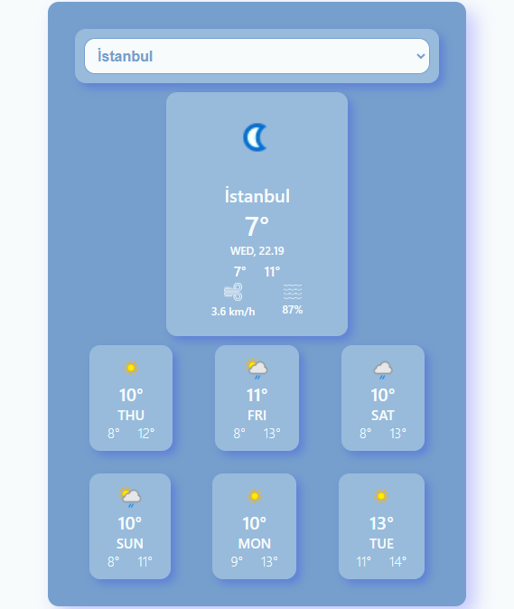

# Weather App
- Weather App has a responsive structure. 
- The app is developed by using [Weather API](https://www.weatherapi.com/).
## Weather App UI

## What can Weather App do?
It can display weekly weather for all the cities in Turkey. There is a dropdown list for choosing a city at the top. Daily weather is displayed at the center. The weather for the next six days are displayed at the bottom.